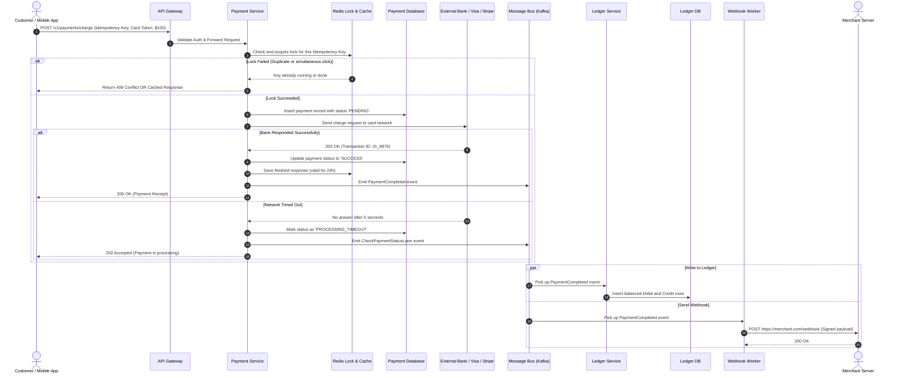

# Architecture & Flow: Payment Gateway & Ledger System

This document explains how requests travel through our services when a customer buys something online, and how each component ensures money moves safely.

---

## 1. Step-by-Step Payment Flow

Here is what happens behind the scenes from the moment a user clicks "Pay" to the moment the merchant gets notified:



---

## 2. Main Components

### 2.1 API Gateway
* **Card Data Protection:** Customers send their card details to a separate browser/SDK form that swaps card numbers for safe tokens (like `tok_visa_4242`). The main gateway only ever touches these tokens, keeping sensitive 16-digit card numbers off our app servers.
* **Rate Limiting:** Protects internal databases from traffic spikes using token bucket rate limits for each merchant.

---

### 2.2 Payment Service
* Manages the lifecycle of a charge:
  ```text
  INITIATED -> PENDING -> AUTHORIZED -> CAPTURED -> SETTLED
                       -> FAILED
                       -> REFUNDED
  ```
* Coordinates with external card networks (Visa, Mastercard, Stripe, Adyen).

---

### 2.3 Redis Locks & Deduplication
* Prevents race conditions when two identical requests hit the server at the exact same millisecond.
* Holds a temporary lock while processing (TTL: 120 seconds).
* Saves the finished payment response for 24 to 72 hours so repeated calls get the same answer instantly.

---

### 2.4 Double-Entry Ledger Service
* Runs asynchronously by consuming Kafka events. That way, checkout latency does not wait on heavy accounting queries.
* Enforces the basic accounting rule:
  ```text
  Total Debits - Total Credits = 0
  ```
* Tables are insert-only. If an adjustment is needed, a compensating row is added instead of updating old rows.

---

### 2.5 Midnight Reconciliation Worker
* Downloads raw transaction logs from card networks and banks once a day.
* Compares bank logs against internal database records.
* Automatically flags any discrepancies (such as unexpected fees or missing funds) on a dashboard for the operations team.
