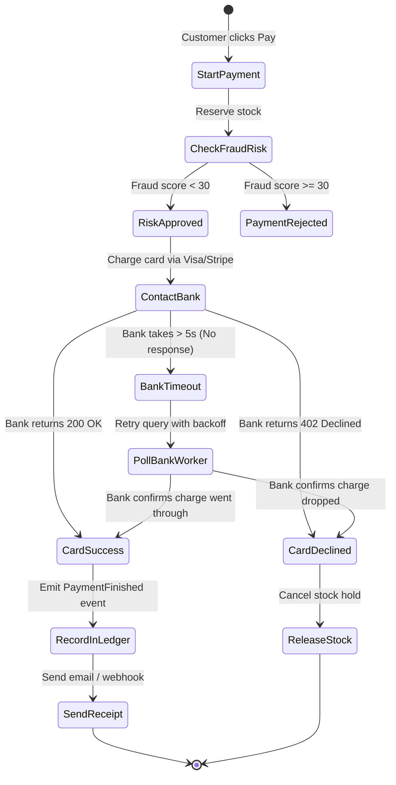

# Distributed Transactions & The Saga Pattern

When a customer buys something, multiple systems have to do their part:
1. **Inventory Service:** Reserve the item so nobody else buys it.
2. **Fraud Service:** Score the payment risk.
3. **Card Processing:** Talk to Visa or Stripe to take the money.
4. **Ledger Service:** Write down the double-entry records.
5. **Notification Service:** Send the receipt to the customer's email.

Traditional database transactions (like Two-Phase Commit / 2PC) do not work here because you cannot hold an open database lock on an external company like Visa for 3 seconds.

Instead, we use **Saga Orchestration** combined with a **Transactional Outbox**.

---

## 1. How the Payment Saga Works

A central payment service coordinates the entire transaction using a clear state machine:



---

## 2. Fixing the "Dual-Write" Problem (Transactional Outbox)

A classic mistake in backend systems is trying to write to the database and publish to a queue in two separate lines of code:

```python
# BROKEN APPROACH:
database.save_order(order)   # 1. Database write succeeds
kafka.publish(order_event)   # 2. Network blip or server crashes right here! Event is lost!
```

If the server crashes between lines 1 and 2, your database says the payment succeeded, but the ledger never hears about it.

### The Fix: Write Events to the Database First
We save the order AND the message in the same local database transaction:

```sql
BEGIN;

-- 1. Update the order status
UPDATE payment_orders 
SET status = 'SUCCESS', psp_transaction_id = 'ch_12345'
WHERE id = 'ord_9876';

-- 2. Insert event into our outbox table inside the EXACT SAME transaction
INSERT INTO outbox_events (
    id, 
    aggregate_type, 
    aggregate_id, 
    event_type, 
    payload, 
    status
) VALUES (
    gen_random_uuid(),
    'PAYMENT',
    'ord_9876',
    'PaymentCompletedEvent',
    '{"order_id": "ord_9876", "amount": 10000, "merchant_id": "merch_456"}',
    'PENDING'
);

COMMIT;
```

A small background reader (or a tool like Debezium reading the database write-ahead log) picks up rows from `outbox_events` and pushes them to Kafka safely. If it crashes, it just restarts and retries.
