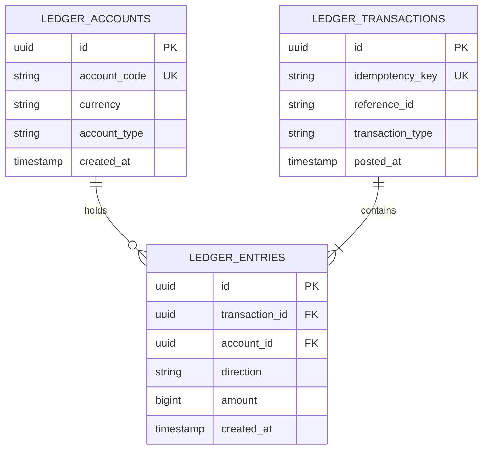

# Double-Entry Accounting in Software Systems

Most simple web apps store user balances in a basic database column:
```sql
-- DANGEROUS IN FINANCIAL APPS:
UPDATE users SET wallet_balance = wallet_balance + 100 WHERE user_id = '123';
```

If a bug runs this query twice, or if a database crash happens halfway through, you have no way to know who sent the money, when it arrived, or why the total balance changed.

Real banks and fintechs use **Double-Entry Bookkeeping**. It has been the standard way humans track money for centuries because it makes losing track of money practically impossible.

---

## 1. The Core Accounting Rules

### Rule 1: The Basic Equation
In any system, total assets always equal the sum of liabilities and equity:

```text
Assets = Liabilities + Equity
```

### Rule 2: Every Transfer Has Two Sides
Money never appears or disappears into thin air. Every transaction has at least two entries:
```text
Total Debits - Total Credits = 0
```

### Rule 3: Never Edit Old Entries
The ledger database is strictly **append-only**. You never run `UPDATE` or `DELETE` on financial records. If someone makes a mistake or issues a refund, you insert a new correcting entry.

---

## 2. Account Categories

| Account Type | What It Holds | Debit Effect | Credit Effect |
| :--- | :--- | :--- | :--- |
| **Asset** | Money the company owns or holds (e.g., Bank Account, Clearing funds) | **Increases (+)** | **Decreases (-)** |
| **Liability** | Money the company owes to others (e.g., Merchant Payout balances) | **Decreases (-)** | **Increases (+)** |
| **Equity** | Company value and shareholder equity | **Decreases (-)** | **Increases (+)** |
| **Revenue** | Money the company earns from processing fees | **Decreases (-)** | **Increases (+)** |
| **Expense** | Fees the company pays (e.g., interchange fees paid to Visa) | **Increases (+)** | **Decreases (-)** |

---

## 3. Real Transaction Examples

### Example 1: Customer Buys a $100 Item ($3 Fee, $97 to Merchant)

When a customer pays $100 using a credit card:
1. Our bank account (Asset) increases by $100.
2. We owe the merchant (Liability) $97.
3. We earned a fee (Revenue) of $3.

| Leg # | Account Name | Type | Direction | Amount (in cents) |
| :--- | :--- | :--- | :--- | :--- |
| 1 | `asset:bank:stripe_clearing` | Asset | **DEBIT** | `10000` ($100.00) |
| 2 | `liability:merchant:merch_456` | Liability | **CREDIT** | `9700` ($97.00) |
| 3 | `revenue:platform_fees` | Revenue | **CREDIT** | `300` ($3.00) |

```text
Total Debits = $100.00
Total Credits = $97.00 + $3.00 = $100.00
Difference = $0.00 (Balanced)
```

---

### Example 2: Merchant Withdraws $97 to Their Bank Account

When we wire $97 to the merchant's real-world bank account:
1. Our debt to the merchant goes down by $97.
2. Our physical bank balance drops by $97.

| Leg # | Account Name | Type | Direction | Amount (in cents) |
| :--- | :--- | :--- | :--- | :--- |
| 1 | `liability:merchant:merch_456` | Liability | **DEBIT** | `9700` ($97.00) |
| 2 | `asset:bank:stripe_clearing` | Asset | **CREDIT** | `9700` ($97.00) |

---

### Example 3: Full Refund ($100 back to Customer)

If a customer returns the item and we refund the $3 fee:
| Leg # | Account Name | Type | Direction | Amount (in cents) |
| :--- | :--- | :--- | :--- | :--- |
| 1 | `liability:merchant:merch_456` | Liability | **DEBIT** | `9700` ($97.00) |
| 2 | `revenue:platform_fees` | Revenue | **DEBIT** | `300` ($3.00) |
| 3 | `asset:bank:stripe_clearing` | Asset | **CREDIT** | `10000` ($100.00) |

---

## 4. Ledger Data Model



---

## 5. Fast Balance Lookups (Daily Snapshots)

If a merchant has 10 million transactions over 3 years, running `SUM(amount)` every time they open their mobile app will kill database performance.

### How We Speed It Up
1. A nightly background worker runs at midnight.
2. It calculates the closing balance for every active account and saves it in a `balance_snapshots` table.
3. When fetching the current balance during the day:
   ```text
   Current Balance = Yesterday's Closing Snapshot + Sum of Today's Entries
   ```
Instead of summing millions of historical rows, we only sum the few hundred entries created today.
