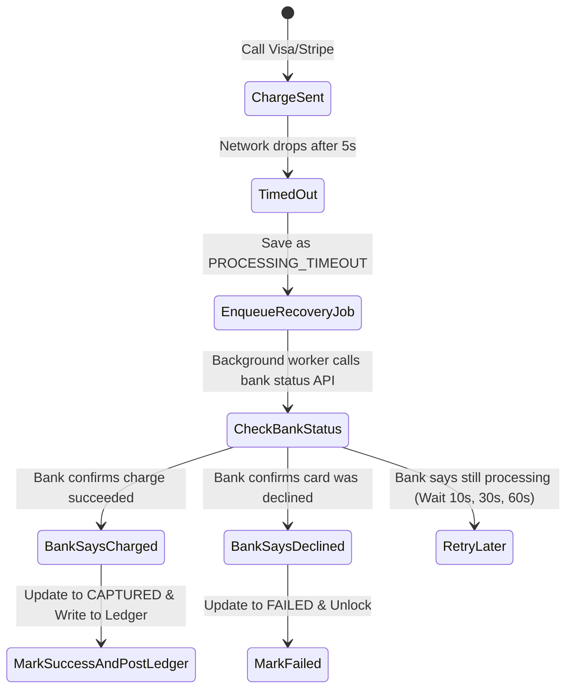

# Handling Failures & Outages

In payment engineering, things will break: network cables get cut, external banks go down, and message queues get backed up. Here is how we handle each failure mode.

---

## 1. Failure Modes & Fixes

| What Broke | What Happens | How We Fix It |
| :--- | :--- | :--- |
| **External Bank Times Out** | We don't know if the customer's card was charged. | Mark payment as `PROCESSING_TIMEOUT`. Do not issue an immediate refund. An asynchronous worker queries the bank API with exponential backoff until we get a clear YES or NO. |
| **Merchant Receives Duplicate Webhook** | Merchant might deliver the same item twice. | Merchants must deduplicate by webhook `event_id` in their database before fulfilling orders. |
| **Redis Cache Dies** | Distributed locks stop working temporarily. | The database enforces a `UNIQUE(merchant_id, idempotency_key)` constraint. The database stops duplicates even if Redis is down. |
| **Kafka Queue Goes Down** | Events cannot be delivered to consumers. | Events stay safely stored in the SQL `outbox_events` table until Kafka recovers. No data is lost. |
| **Database Primary Node Crashes** | Writes fail for a few seconds. | High-availability PostgreSQL / CockroachDB automatically promotes a replica within 5 to 15 seconds. |
| **A Broken Message Breaks a Consumer** | A single bad payload blocks the whole queue. | Retry 3 times. If it still fails, move it to a Dead Letter Queue (DLQ) and alert the engineering team. |

---

## 2. Resolving Bank Timeouts (State Machine)

When an external bank call takes longer than 5 seconds and drops:

