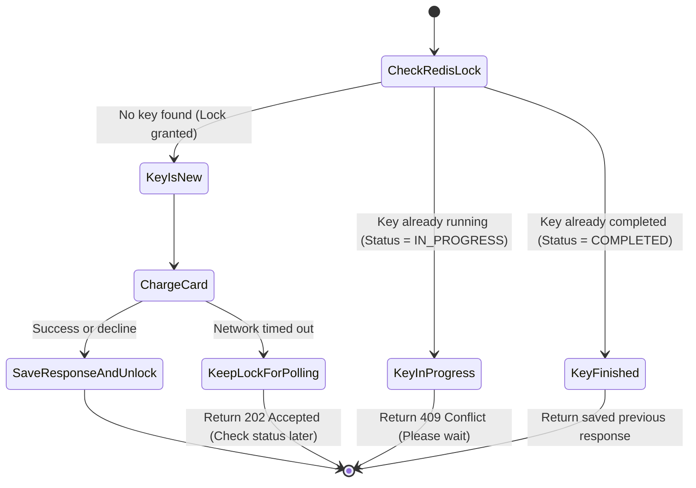

# Idempotency & Concurrency Guide

When people shop online, bad network connections and hasty double-clicks are completely normal. If our system does not handle retries carefully, customers will get charged two or three times for a single purchase.

---

## 1. What Idempotency Actually Means

In plain English: an API call is idempotent if calling it five times with the same inputs causes the exact same effect as calling it once.

```text
f(f(x)) = f(x)
```

If you send `$50` with key `order_123`, the first call charges `$50`. The next four calls simply return the receipt from the first call without charging another dime.

---

## 2. The Idempotency Key Workflow

Clients generate a unique UUIDv4 string (e.g., `9b1deb4d-3b7d-4bad-9bdd-2b0d7b3dcb6d`) before sending a payment request.



---

## 3. Atomic Lock Script (Redis Lua)

Checking if a key exists and saving a new lock must happen in a single step. If there is a delay between checking and setting, two simultaneous requests will both pass. We use this Lua script in Redis:

```lua
-- KEYS[1]: Redis key, like "idempotency:merch_123:req_abc456"
-- ARGV[1]: SHA-256 hash of the request body
-- ARGV[2]: Lock timeout in seconds (e.g., 120)

local current = redis.call('GET', KEYS[1])

if current == false then
    -- Key doesn't exist yet: Lock it and mark IN_PROGRESS
    local payload = cjson.encode({
        status = "IN_PROGRESS",
        request_hash = ARGV[1],
        created_at = redis.call('TIME')[1]
    })
    redis.call('SET', KEYS[1], payload, 'EX', ARGV[2])
    return {1, "LOCK_ACQUIRED"}
else
    local data = cjson.decode(current)
    
    -- Check if someone reused an old key with different payment details
    if data.request_hash ~= ARGV[1] then
        return {-1, "PAYLOAD_MISMATCH_ERROR"}
    end
    
    if data.status == "IN_PROGRESS" then
        return {0, "IN_PROGRESS"}
    elseif data.status == "COMPLETED" then
        return {2, data.response_body, tostring(data.status_code)}
    end
end
```

---

## 4. Real-World Edge Cases

### Case 1: The User Retries While the First Call is Still Running
* **What happens:** The first request takes 2 seconds to reach the bank. At second 1, the user taps "Pay" again.
* **How we handle it:** The second request sees the `IN_PROGRESS` status in Redis and immediately returns `409 Conflict`:
  ```json
  {
    "error": "request_in_progress",
    "message": "Your payment is currently being processed. Please wait a moment."
  }
  ```

### Case 2: Someone Reuses a Key with Different Amounts
* **What happens:** A client tries to charge `$10` with key `abc`, and then tries to charge `$500` with the same key `abc`.
* **How we handle it:** We calculate a SHA-256 hash of the entire request body (`merchant_id + path + amount + currency`). If the hashes do not match, we reject it with `422 Unprocessable Entity`.

### Case 3: Redis Crashes
* Redis is our fast memory layer, but our SQL database is the ultimate source of truth.
* The `payment_orders` database table has a strict `UNIQUE(merchant_id, idempotency_key)` constraint. Even if Redis goes down, the database will never allow two records with the same key.

---

## 5. Safe Balance Updates (Optimistic Locking)

When updating account balances, locking the entire table with `SELECT ... FOR UPDATE` slows down the whole system. Instead, we use a simple version number check:

```sql
-- 1. Read balance and version
SELECT balance, version FROM accounts WHERE account_id = 'acc_user_456';

-- 2. Update balance only if the version hasn't changed since step 1
UPDATE accounts 
SET balance = balance - 10000, 
    version = version + 1 
WHERE account_id = 'acc_user_456' 
  AND version = 14 
  AND balance >= 10000;

-- 3. If zero rows updated, another transaction beat us to it. Fetch new version and retry.
```
