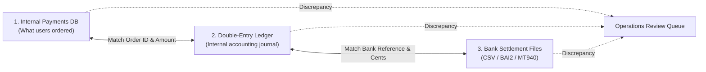

# Bank Reconciliation & Settlement

Reconciliation is how we make sure the balance in our database matches the actual money in our bank accounts.

---

## 1. Why Reconciliation Matters

Even if our internal code is bug-free, the banking world is messy:
1. **Fee Adjustments:** Visa or Mastercard might take a $2.85 fee instead of the $2.90 our system estimated.
2. **Settlement Delays:** Card charges usually take 1 to 2 business days (T+1 or T+2) to actually land in the bank account.
3. **Ghost Transactions:** An API call dropped midway, but the customer's bank went ahead and charged their card anyway.
4. **Chargebacks:** A buyer calls their bank to dispute a transaction, and the bank takes the money back directly without asking us first.

---

## 2. The 3-Way Matching Flow

Every night at midnight, our system compares records from three separate places:

---

## 3. How the Nightly Matching Engine Works

1. **Download Settlement Files:**
   * At 00:00 UTC, a batch worker downloads daily clearing files (SFTP/S3) from banking partners like Chase, Stripe, or Adyen.
   * Parses standard banking formats (CSV, BAI2, MT940, ISO 20022).
2. **Exact Matching:**
   * Matches on `(bank_transaction_id, currency, gross_amount)`.
   * When a match is found, the transaction status flips to `RECONCILED`.
3. **Fee Adjustments:**
   * If the gross payment matches but the bank took a slightly different processing fee, the system automatically posts an adjustment entry to the `expense:interchange_fees` ledger account.
4. **Flagging Missing Records:**
   * **Missing from Our Database:** The bank says they collected $50, but our system never recorded a success. The system logs an urgent ticket for financial review.
   * **Missing from the Bank:** Our system marked a payment as successful 3 days ago, but the bank never paid out. The system flags this for investigation.
